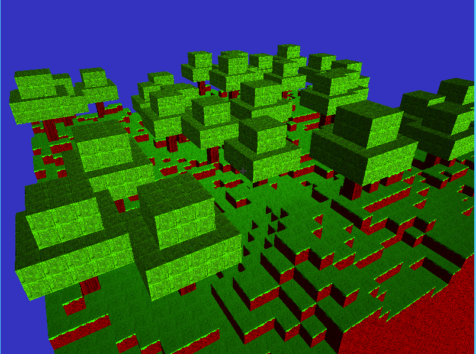

# voxels

Voxel engine written with OpenGL and C++



## Deps

* GLFW3
* GLEW
* glm
* [LibNoise](http://libnoise.sourceforge.net/)

## Building

```bash
mkdir build
cd build
cmake ..
make
```

Be sure to run the binary alongside the `assets/` folder, i.e.

```bash
$ ls
build/
assets/
$ ./build/voxels
```

## TODO

- [ ] loading and unloading of chunks dynamically
- [ ] infinite world generation
- [ ] physics?
